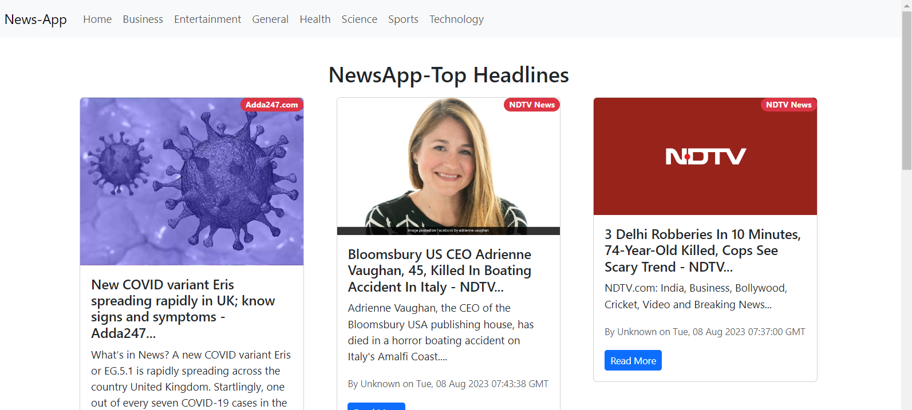

# News React Web App

The News React Web App is a dynamic web application that allows users to explore news articles from different categories such as Entertainment, Business, General, Health, Sports, Science, and Technology. Stay informed about the latest happenings in the world through our user-friendly interface.



## Features

- Browse news articles from various categories.
- User-friendly interface with easy navigation.
- View detailed information about each news article including title, description, source, and publication date.
- Responsive design for optimal viewing on different devices.

## Getting Started

1. Clone the repository:

   ```bash
   git clone https://github.com/yourusername/news-react-web-app.git
   
2. Navigate to the project directory:

   bash
   cd news-application
   

3. Install the required dependencies:

   bash
   npm install
   

4. Start the development server:

   bash
   npm start
   

5. Open your browser and go to `http://localhost:3000` to access the News Application.


## Usage

1. On the homepage, you'll see a list of top news articles from various sources.
2. Use the navigation bar to select different categories (e.g., Business, Entertainment, Health, etc.).
3. Click on a news article to view its detailed information.
4. Navigate back to the homepage or switch to a different category using the navigation bar.

## Technologies Used

- React: JavaScript library for building user interfaces.
- Bootstrap: Front-end framework for responsive and mobile-first design.
- React Router: Library for handling navigation within a React application.
- News API: External API used to fetch news articles from various sources.